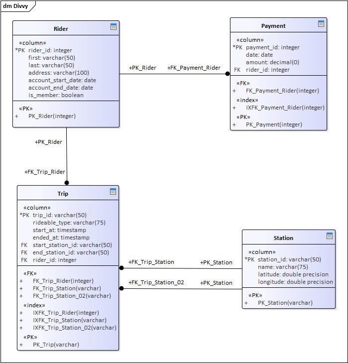
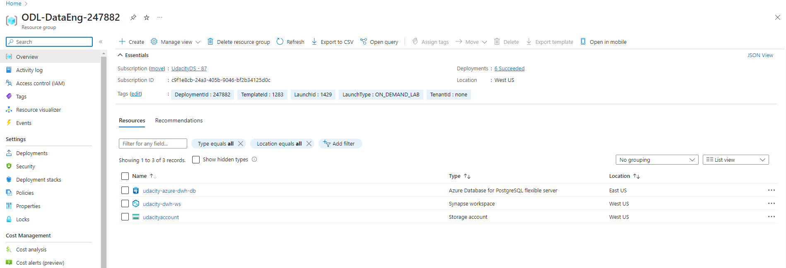
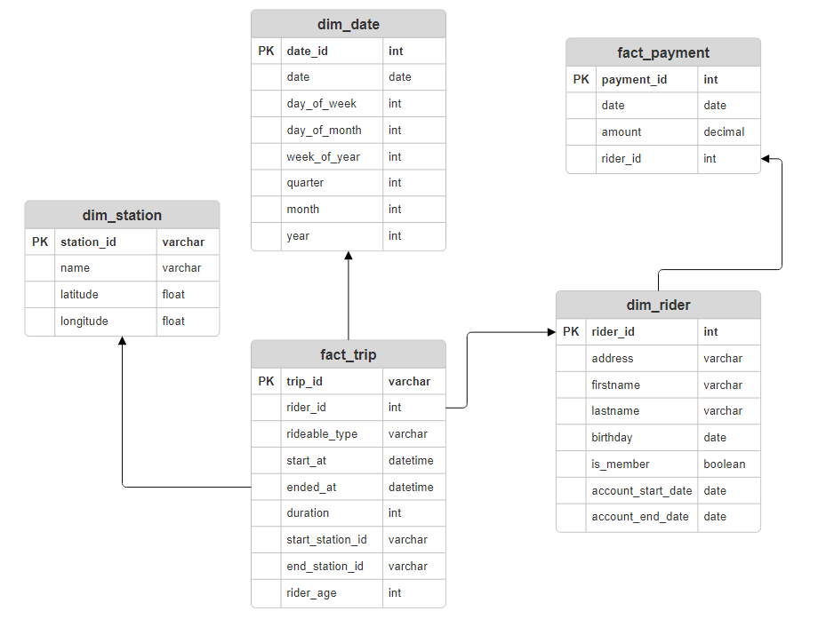
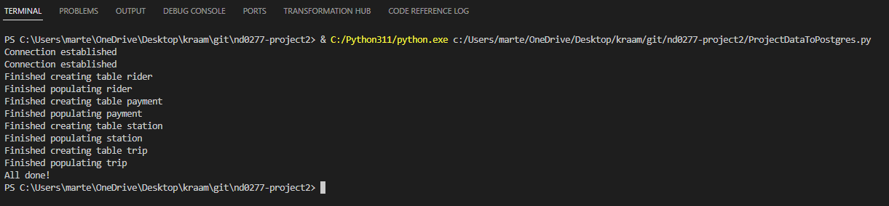
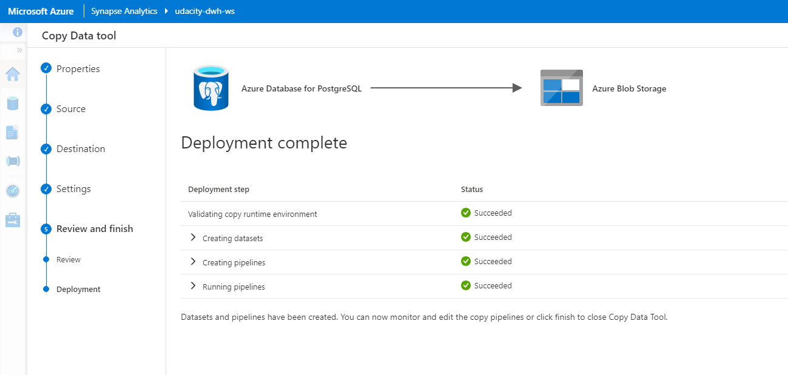
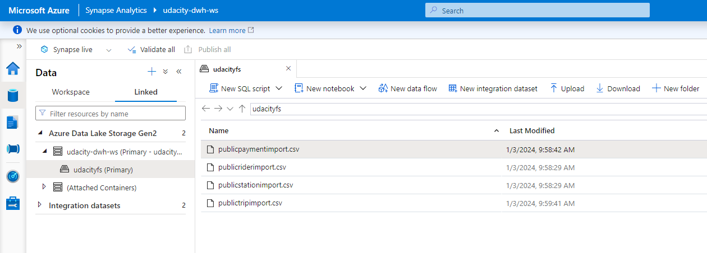
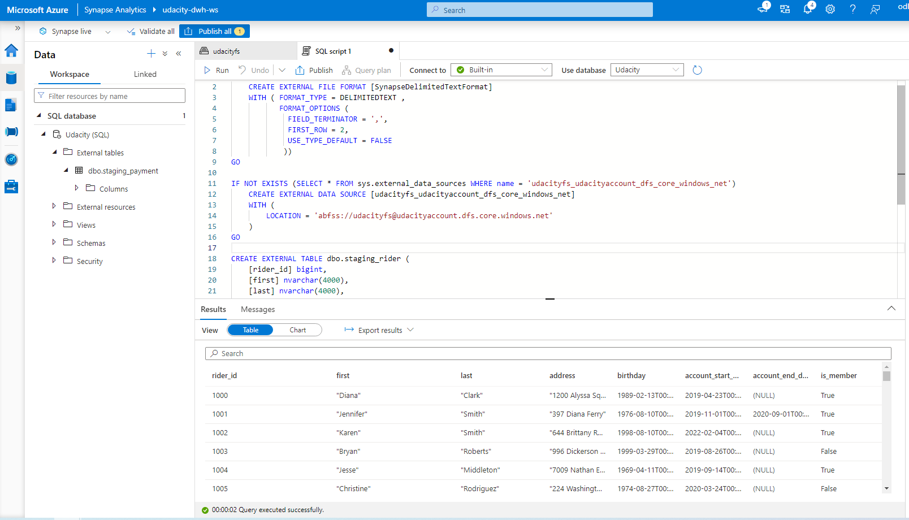
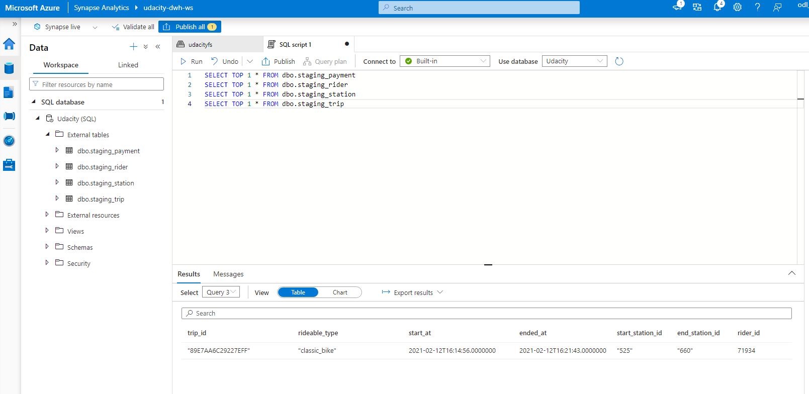
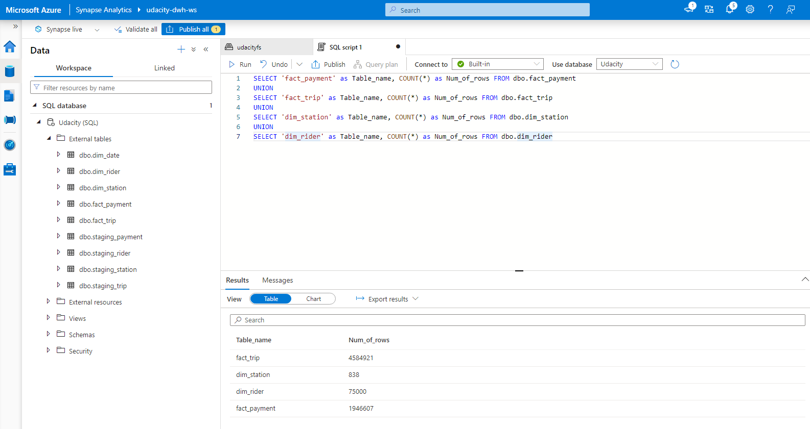

# Building an Azure Data Warehouse for Bike Share Data Analytics 

Divvy is a bike sharing program in Chicago, Illinois USA that allows riders to purchase a pass at a kiosk or use a mobile application to unlock a bike at stations around the city and use the bike for a specified amount of time. The bikes can be returned to the same station or to another station. The City of Chicago makes the anonymized bike trip data publicly available for projects like this where we can analyze the data.

Since the data from Divvy are anonymous, we have created fake rider and account profiles along with fake payment data to go along with the data from Divvy. The dataset provided by Udacity looks like this:

This is actually wrong because there were provided only four data files and they form together the following dataset:

## The goal of this project

### To develop a data warehouse solution using Azure Synapse Analytics

You will:
* Design a star schema based on the business outcomes listed below;
* Import the data into Synapse;
* Transform the data into the star schema;
* and finally, view the reports from Analytics.

## The business outcomes you are designing for are as follows:

1. Analyze how much time is spent per ride
* Based on date and time factors such as day of week and time of day
* Based on which station is the starting and / or ending station
* Based on age of the rider at time of the ride
* Based on whether the rider is a member or a casual rider

2. Analyze how much money is spent
* Per month, quarter, year
* Per member, based on the age of the rider at account start

3. EXTRA CREDIT - Analyze how much money is spent per member
* Based on how many rides the rider averages per month
* Based on how many minutes the rider spends on a bike per month

## Getting started

What do you need in this project mostly is an Azure account.

## Task 1: Create your Azure resources

* Create an Azure Database for PostgreSQL.
* Create an Azure Synapse workspace. Note that if you've previously created a Synapse Workspace, you do not need to create a second one specifically for the project.
* Use the built-in serverless SQL pool and database within the Synapse workspace

## Task 2: Design a star schema

Below you can find the designed star schema:

## Task 3: Create the data in PostgreSQL

To prepare your environment for this project, you first must create the data in PostgreSQL. This will simulate the production environment where the data is being used in the OLTP system. This can be done using the Python script provided for you in ProjectDataToPostgres.py

The successful output should look like this:

You can verify this data exists by using pgAdmin or a similar PostgreSQL data tool:

## Task 4: EXTRACT the data from PostgreSQL

In your Azure Synapse workspace, you will use the ingest wizard to create a one-time pipeline that ingests the data from PostgreSQL into Azure Blob Storage. This will result in all four tables being represented as text files in Blob Storage, ready for loading into the data warehouse.

As a result, all four tables are extracted in a CSV format in Azure Storage account:

## Task 5: LOAD the data into external tables in the data warehouse

Once in Blob storage, the files will be shown in the data lake node in the Synapse Workspace. From here, you can use the script-generating function to load the data from blob storage into external staging tables in the data warehouse you created using the serverless SQL Pool.

When all tables are created, they are visible in Azure Synapse and they can be queried:

## Task 6: TRANSFORM the data to the star schema using CETAS

The SQL scripts are used to transform the data from staging tables to the final star schema that was designed before.

The serverless SQL pool won't allow you to create persistent tables in the database, as it has no local storage. So, use CREATE EXTERNAL TABLE AS SELECT (CETAS) instead. CETAS is a parallel operation that creates external table metadata and exports the SELECT query results to a set of files in your storage account.

The result of transforming is following:

